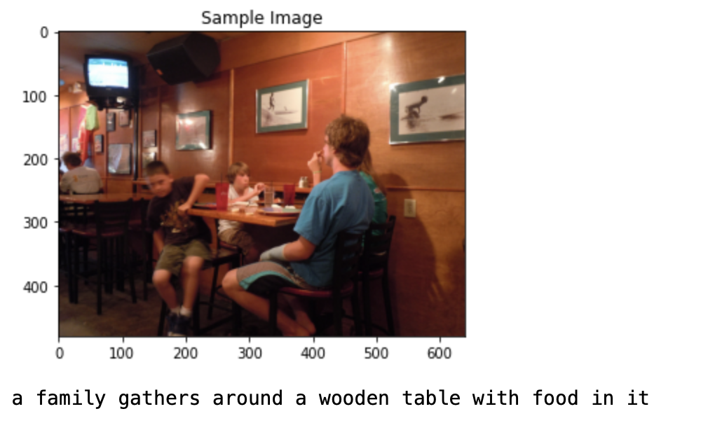
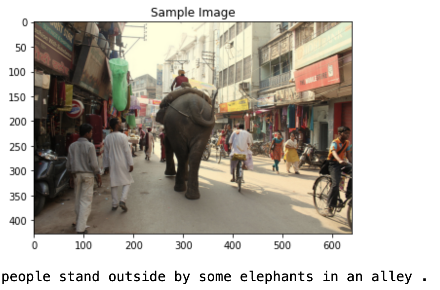
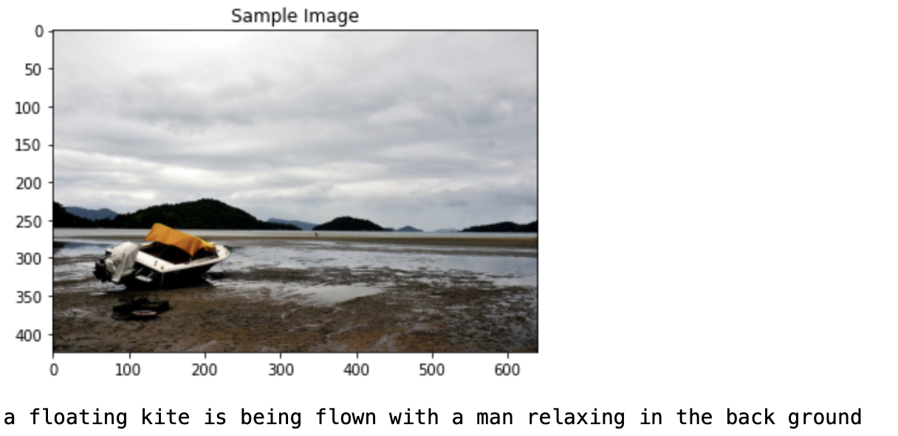
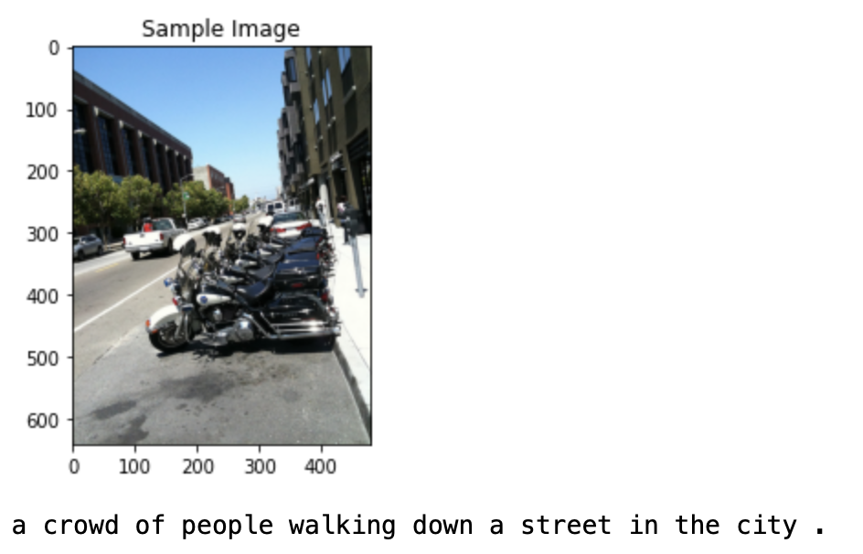
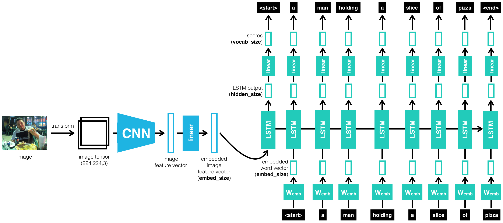

# Image Captioning Project


This project demonstrates the usage of a combined CNN-RNN model to generate captions for images. 
It was completed as part of Udacity's Computer Vision Nano-degree and the model is inspired by
the paper - [Show and Tell : A Neural Image Caption Generator - O.Vinyals et. al](https://arxiv.org/abs/1411.4555v2)  but is not meant at all to reproduce their exact results. The dataset used to train the model is the [COCO Dataset](https://cocodataset.org)

Here's a demo of some nicely generated captions on unseen images.



Also here's a couple examples of bad captions generated by the model...



# Setup & Usage

1. Download the COCO Image dataset images & captions into a data/ directory 
```bash
./download_data.sh
```

2. Create and configure the Python environment
```bash
conda env create --file image_caption.yml
conda activate image_caption
python -m ipykernel install --user --name=image_caption
```
3. Run the Training Notebook : [Training Notebook](1_Train_Model.ipynb)

4. Inference. Evaluate on Test Data : [Inference Notebook](2_Inference.ipynb)


# Architecture



## Model
The CNN encoder is a pretrained Resnet-50 that has non-configurable weights during the training of this task. This encoder maps an image into a feature vector of size 4096. We place a fully connected layer to decrease the dimensionality from 4096 to 256. This image representation is later fed into the RNN decoder.

The RNN decoder consists of 3 layers; an embedding layer that maps word indices into a fixed 256-wide representation. After that is a single LSTM layer that takes in the 256-wide word embedding and holds a 512-wide tensor as a hidden state. After the LSTM is a fully connected layer that learns a classification into one of the target words in the vocabulary.

## Training
Not much time was spent on optimizing hyperparameters and also proper model validation is missing. 
The training is computationally expensive and due to the limited resources for compute this model was only trained for a few epochs on the full dataset.

## Inference
I used a sampling based approach to caption generation. 
In this the RNN is initially fed in the encoded image batch after beign encoded with the CNN.
After that, words are sampled sequentially through the RNN's output word probability distributions.
